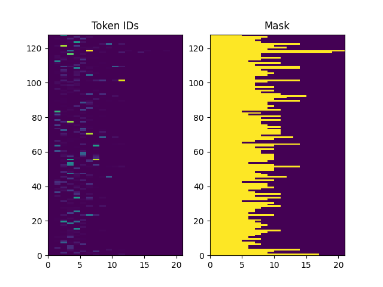
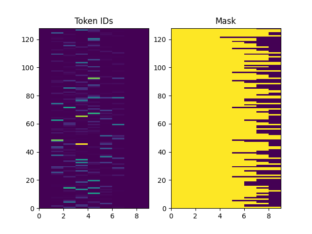
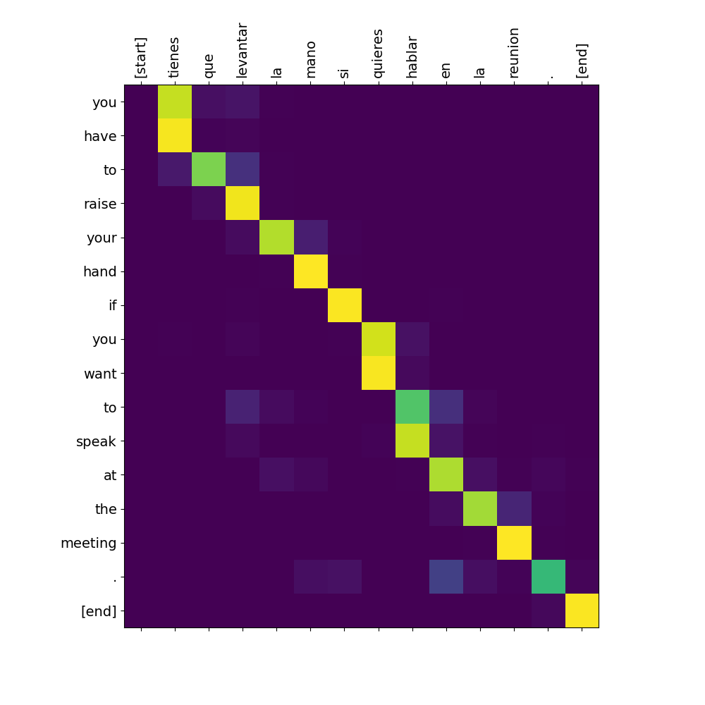
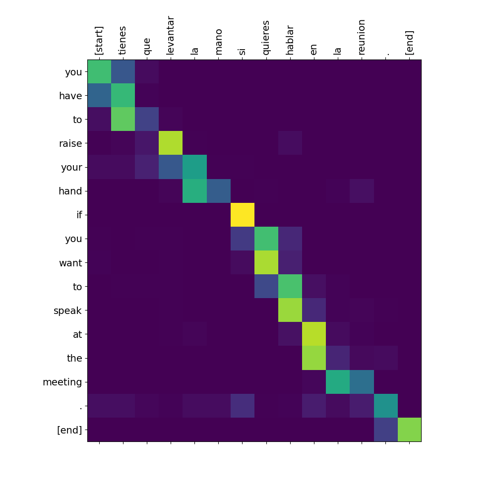

# nmt with attention

原文链接为 [https://www.tensorflow.org/tutorials/text/nmt_with_attention?hl=zh-cn](https://www.tensorflow.org/tutorials/text/nmt_with_attention?hl=zh-cn)

## 下载数据集

```c
wget  http://storage.googleapis.com/download.tensorflow.org/data/spa-eng.zip
unzip spa-eng.zip
```

## 运行

```c
workon py38
pip install tensorflow-addons==0.19.0
pip install tensorflow-text==2.8.2
pip install scikit-learn
python train.py
```

## 思考

- tf2 使用 enable_op_determinism 非常有用，可以稳定复现结果。pytorch 也有对应的函数。
- 使用 bucketing 技术，也就是不同长度的句子放在不同的的batch中可以明显提高训练速度。然而，bucket 之后会留下一些碎片 batch，如下面这样（标准的 batch_size=128），这些碎片会导致 tf2 出现[重追踪问题](https://www.tensorflow.org/guide/function#tracing) 。如何处理这些碎片呢？能否通过 concat 形成完整的 batch 呢，我在 patch_broken_batch 函数中进行了尝试没有成功。

    ```c
    bad batches: [TensorShape([110, 4]), TensorShape([23, 9]), TensorShape([17, 13]), TensorShape([121, 19]), TensorShape([52, 41])]
    ```

- [tf2 教程](https://www.tensorflow.org/text/tutorials/nmt_with_attention)中的 tf.keras.layers.TextVectorization 在 adapt 时非常慢，我不得不换为 tf.keras.preprocessing.text.Tokenizer 进行处理。
- 模型参考 [https://github.com/OpenNMT/OpenNMT-tf](https://github.com/OpenNMT/OpenNMT-tf) 中的 RNMT+，文章为 [https://arxiv.org/pdf/1804.09849.pdf](https://arxiv.org/pdf/1804.09849.pdf)。
- 在 tf.function 中，如果输入的类型不是固定的，建议使用 input_signature 解释输入的形状从而避免重追踪，我的理解是 input_signature 可以把 `None` 编译为 `tf.placeholder([None,])`。记得在 tf.function 中计算形状时，不要使用 `inp.shape[0]`，而应该使用 `tf.shape[inp](0)`。
- 在没有使用 input_signature 之前，我发现使用 bucketing 后，训练时前几个 epoch 时间特别长，后面的 epoch 时间比较短，后来发现原因就是**重追踪**导致的，tf.function 会记录第一次遇到的输入形状，对于相同的形状会复用 graph，之后遇到不同的输入形状则会发生重追踪，消耗大量资源，这也是为什么不使用 bucketing 直接使用 padded_batch 会导致程序报错的原因，因为 padded_batch 后各种各样的形状都有，重追踪导致显存资源被消耗完。
- 使用 bucketing 处理后，句子平均长度是 11.7；使用 padded_batch 处理后，句子平均长度是 21.9。这两种情况下的 attention 结果有些不同，看起来 padded_batch 对齐更准确一些。根据后来 `mask_zero` 测试，原因有可能是 padding zero 的影响。
- `mask_zero` 有必要嘛？我认为是有必要的，在 embdding 层加上 [`mask_zero=True`](https://www.tensorflow.org/api_docs/python/tf/keras/layers/Embedding#input-shape)，可以屏蔽 padding zero 的影响，肉眼可见对于 attention 的效果是积极的，修正了 `[start]` 和 `[end]` 的对齐。<https://stackoverflow.com/questions/47485216/how-does-mask-zero-in-keras-embedding-layer-work>。
- bucketing 的性能比 padded_batch 稍微好一些。padded_batch 句子平均长度是 21.9，准确率是 0.6152，bleu 为 55.62%；bucketing 句子平均长度是 11.7，准确率是 0.6340，bleu 为 58.38%。原因或许可以从句子平均长度来分析：在 padded_batch 的每个 batch 中，句子越往后越稀疏，梯度也就越稀疏，导致梯度估计不准确。而 bucketing 的特性刚好缓解了这一点。

    <table>
    <tr>
        <td style="text-align:center">padded</td>
        <td style="text-align:center">bucketing</td>
    </tr>
    <tr>
        <td></td>
        <td></td>
    </tr>
    </table>

<table>
  <tr>
    <td></td>
    <td style="text-align:center">图 1</td>
    <td style="text-align:center">图 2</td>
    <td style="text-align:center">图 3</td>
  </tr>
  <tr>
    <td>padded</td>
    <td></td>
    <td></td>
    <td></td>
  </tr>
  <tr>
    <td>padded mask</td>
    <td></td>
    <td></td>
    <td></td>
  </tr>
  <tr>
    <td>bucket</td>
    <td></td>
    <td></td>
    <td></td>
  </tr>
  <tr>
    <td>bucket mask</td>
    <td></td>
    <td></td>
    <td></td>
  </tr>
</table>
